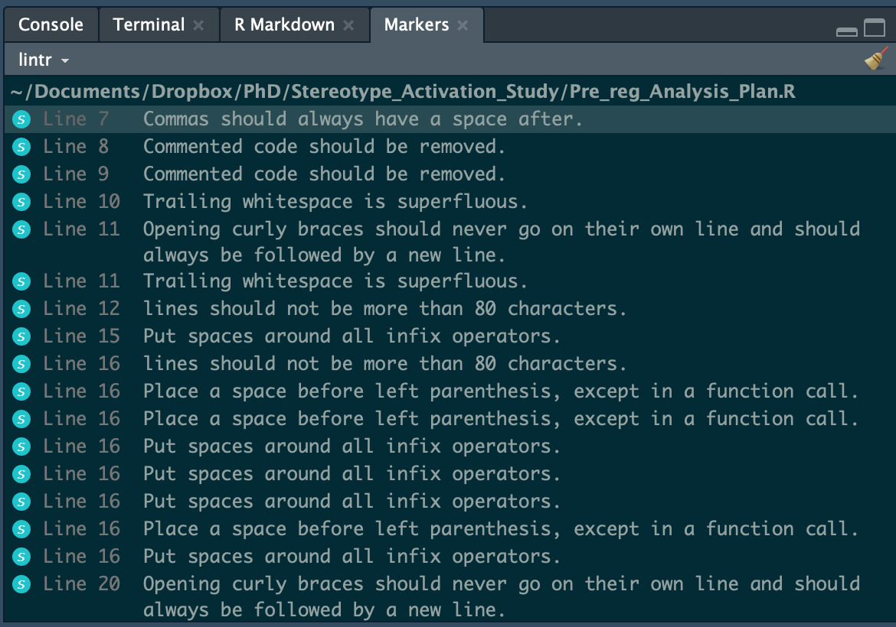

# Writing Clear and (Human) Readable Code

## Introduction 

Have you ever opened a syntax or script file two years after running an analysis only find that you have no memory of the code?
On top of this you may have lots of variables being passed to arcane functions, which are in turn passed back to themselves:

```
x <- thisDoesAThing(doToThis,DoToThat)
x <- thisDoesAnotherThing(doToThat,DoToThis,thenThis)
print(x)
```
Or you may have meaningless file names such as "analysis_1final_FINAL.R, or "onlyusethisoneforanalysis_onamonday2a.py".

If you have not - then you are one of the lucky few!
For everyone else, this is frustrating enough on personal projects.
But imagine if a collaborator sent you those files, or you had cloned them from github, or the Open Science Framework.
Not only would you have no memory the code, but you would have never known it in the first place!


This chapter aims to introduce some principals of 'code hygiene', otherwise known as *linting*.
Linting includes code formatting, naming conventions, and writing useful comments.  
Some integrated development environments (IDEs) include automatic linting.
There are also packages in Python that will lint code for you (e.g. [autopep8](https://pypi.org/project/autopep8/).

By keeping the following advice in mind while coding, your code will be more resuable, adaptable, and clear.
  
Indeed, point 7 of the [Zen of Python](https://www.python.org/dev/peps/pep-0020/) is:

>Readability Counts

## Code Styling

Style guidelines differ between organisations, languages, and over time ^[The Python style guide Python Enhancement Proposal (PEP) 8 has had numerous revisions since it was released in 2001.].
It is important that you work to a framework that is best for your purposes: be they for your benefit, or the benefit of others.
It is also important to remain consistent^[and not consistently inconsistent]!

Style guidelines include advice for file naming, variable naming, use of comments, and whitespace and bracketing.

The following are links to existing style guide that may be of use when deciding how to format your code:

* [PEP8](https://www.python.org/dev/peps/pep-0008/) for Python.
* [Hadley Wickham's](http://adv-r.had.co.nz/Style.html) style guide for R.
* [Google's](https://google.github.io/styleguide/Rguide.xml) style guide for R.
* [Microsoft's](https://docs.microsoft.com/en-us/dotnet/csharp/programming-guide/inside-a-program/coding-conventions) style guide for C#.
* [PEP7](https://www.python.org/dev/peps/pep-0007/) for C.

However, to get started quickly, the following sections with present some advice for code style.

## File Naming
The [Centre for Open Science](http://help.osf.io/m/bestpractices/l/609932-file-naming) has some useful suggestions for naming of files, particularly ensuring that they readable for both humans and machines.
This includes avoiding the use of wildcard characters (@£$%) and using underscores ("\_") to delimit information, and dashes ("\-") to conjunct information or spaces.
They also suggest dating or numbering files, and avoiding words like FINAL (or FINAL-FINAL).
The dating suggestion is the long format `YYYY-MM-DD`, followed by the name of the file, and the version number.
This results in an automatic, chronological order. For example:

```
data <- read.csv("2019-05-17_Turing-Way_Book-Dash.csv")

```
The R style guide suggests keeping file names basic.
This might be appropriate for small compact projects, however over larger projects with lots of similar files, or if you are not using version control (see chapter /?) it may be more appropriate to use the COS guidelines.

### Versioning
An extra consideration to file-naming is versioning your software.
Using versioning guidelines will help avoid using words like "FINAL.R".
A typical convention is the MajorMinorPatch (or MajorMinorRevision) approach.
In this, your first attempt at a package or library might look like this:
```
my-package_1_0_0.py
```
This indicates that the software is in the unrevised/patched alpha stage (0) of the first major release.

## Variable Naming
In maths projects at school,  variables are often unimaginatively named "x","y", and "z".
This brevity is probably because teachers (understandably) do not want to repeatedly write long variable names on the board.
In coding however, you have the freedom to name your variables anything you like.
This can be useful for representing the flow of your script.

Be creative!


### Naming conventions
For clarity and readability, choosing a set of naming conventions for your variables is useful.
There is a large variety, and some people can be quite vocal about which one is 'correct'^[Again, pick one that is right for you!].
These include:

- CamelCase
- lowerCamelCase
- Underscore_Methods
- Kebab-Case^[The Kebab case will not work with some languages, such as R and Python since this will be interpreted as a subtraction sign.]
_ Mixed_Case_With_Underscores
- lowercase

For example:

```{r}
raw_data <- read.csv("data.csv") # Not very creative
rawData <- read.csv("data.csv")  #lowerCamelCase
```

OK, `raw_data` is not very creative, but it could easily have been `spam` or `eggs` if that makes sense in your script.
You may also have a function that recodes a variable:

```
rawDat <- recode(rawDat)
```

Reusing the variable name provides no information about the process that rawDat has been through.
Storing it as a separate variable lets us see what transformations have been carried out on the original variable:

```
rawDat_recoded <- recode(rawDat)
```

If you like you can clear out the old variable using remove as above.  

```
remove(rawDat) #In R
del(rawDat) # In Python
```

It is important to choose ones style and stick to it:

```
ThisIs Because_SwitchingbetweenDifferentformats is.difficult to read.
```

```
Where_as if_you stick_to one_style, your_code will_be easier_to_follow!
```

## Line Length
There is some agreement on the length of coding lines.
PEP8 suggests a maximum of 79 characters per line, and 80 by the R style guide.
This means that the lines can easily fit on a screen, and multiple coding windows can be opened.
It is argued that if your line is any longer than this then your function is too complex and should be separated!
This is the crux of the Tidy method of R programming, which even has a special operator `%>%` which passes the previous object to the next function, so fewer characters are required:

```
recoded_melt_dat <- read_csv('~/files/2019-05-17_dat.csv') %>%
recode() %>%
melt() #We now have a recoded, melted dataframe called recoded_melt_dat
```

## Commenting
Comments have been described as "Love letters to your future self"^[Jon Peirce, creator of PsychoPy].
Comments can be blocked or inline.  
The PEP8 guidelines have firm suggestions that block comments should be full sentences, have two spaces following a period, and follow a dated style guide(Strunk and White)^[Fortunately the Elements of Style no longer 'requires' an unfair emphasis on masculine pronouns.].
Whereas inline comments should be used sparingly.
Keeping clear and concise comments not only allows you to keep track of the decisions you have made, what particular functions do, and what variables are used, it also allows other people to see your thought processes.
The syntax for comments varies with programming languages.
In R and Python, a hashtag is used, whereas in C and Java the brackets `/* /*` are used, and in C++/C# a double slash `//` comments single lines.

In Python:
```{python}
times = 10 # Set integer
my_variable = "my variable is %s times better than yours" %times #Set my_variable to a string
print(my_variable) #print the value
```

In R:
```{r}
my_func = function(number){ #R function

(number * 5) - 2
}
print(my_func(2))
```
In C:
```{c}
static int
{
int my_int = 57 ; /* C for completion */
}
```
For longer comments, information can be included above the code block. In Python you can use triple speech marks as parenthesis.
This will comment out anything in between.

```{python}
"""
The following function takes a number, multiplies it be 5, and subtracts 2.
This may seem pointless, but is simple for the purpose of demonstration.
"""
def myfunc(numb): #python function
      return((numb*5)-2)
print(myfunc(8))

```

Longer blocks of comments are not available in R.
There are ways around this, such as setting up a string, or an if(false) statement:

```

"1 - This is a string. It will not be evaluated by R, and will not raise
and exception"

if(false){
2 - All of your comment can go here and will never be evaluated.
It also means you keep to the 80 character line length suggestion.
Also, in RStudio you can fold away the comment using the arrow next to the 
line number of the if statement.
}
```

Or commenting out individual lines:

```{r}
#This is also a very long comment
#covering many lines.
```
Your IDE will probably have a keyboard shortcut for commenting out blocks though.

## Indentation
The R style guide suggests that lines should be separated:
```
by
  two spaces
```
And not
```
 a mixture 
   of 
   	tabs 
   	  and 	spaces.
```

Obviously, sometimes the arguments of a function can far expand 80 characters.
In this case, it is recommended that the second line be indented to the start of the arguments:

```
my_variable <- a_really_long_function(data = "2019-05-17_Long_File_Name_2",
                                      header = TRUE, verbose = TRUE)

```

These are of course just guidelines, and you should choose elements that suit your own coding style.
However, and again, it is important to ensure that you are consistent when collaborating, and can agree on a common style.
It could be useful to create a readme file describing your coding style so collaborators or contributors can follow your lead.


### ...end. ...end.  ...or end.\\n

If you are sharing text files or working collaboratively on manuals or documents, then there is a lot of controversy surrounding whether to use one or two spaces after a period.
When using Markdown, it can actually be clearer to include a new line after every sentence.^[This chapter (and most, if not all, of this book) has a new line after every sentence]
This makes the raw text easier to read, and solves the spacing issue.


# Tools
As mentioned earlier, there are some automatic tools that you can use to lint your code to existing guidelines.
These range from plugins for IDEs, packages that 'spell check' your style, and scripts that automatically lint for you.

## lintr
lintr is an R package that spell checks your code using a variety of style guidelines.  It can be installed from CRAN.
The function `lint` takes a filename as an argument, and a list of 'linters' that it should check your code against.
These range from whitespace conventions to checking that curly braces do not have their own lines.




Lintr provides a list of markers with recommendations for changing the formatting of your code line-by-line, meaning it is best used early and often in your project.

## Autopep8
Autopep8 is a Python module that can be run from the terminal and automatically formats a file to PEP8 guidelines.  It is available on [pypy](https://pypi.org/project/autopep8/), and can be installed using pip.


To some extent, the module can also be used on R scripts!


# Summary
In summary, writing clear, well commented, and re-usable code benefits not only you, but the community (or audience) that you are developing it for.
This may be your lab, external collaborators, stakeholders, or you might be writing open source software for global distribution!
Whatever scale you work at, readability counts!
