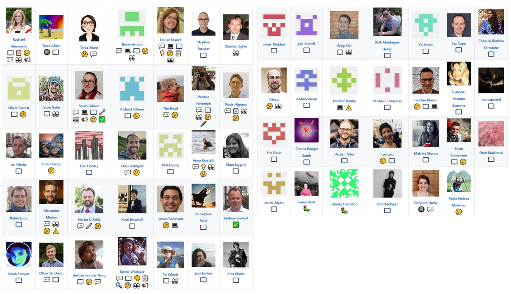

# Welcome to the Turing Way

_The Turing Way_ is a lightly opinionated guide to reproducible data science.

Our goal is to provide all the information that researchers need at the start of their projects to ensure that they are easy to reproduce at the end.

This also means making sure PhD students, postdocs, PIs, and funding teams know which parts of the "responsibility of reproducibility" they can affect, and what they should do to nudge data science to being more efficient, effective, and understandable.

The book is collaboratively written and open from the start.
If you would like to contribute please [get in touch](https://github.com/alan-turing-institute/the-turing-way#get-in-touch) or visit our [contributing guidelines](https://github.com/alan-turing-institute/the-turing-way/blob/master/CONTRIBUTING.md) to learn how to start.

We value the participation of every member of our community and want to ensure that every contributor has an enjoyable and fulfilling experience.
Accordingly, everyone who participates in the _Turing Way_ project is expected to show respect and courtesy to other community members at all times.
All contributions must abide by our [code of conduct](https://github.com/alan-turing-institute/the-turing-way/blob/master/CODE_OF_CONDUCT.md)

## A little more background

Reproducible research is necessary to ensure that scientific work can be trusted.
Funders and publishers are beginning to require that publications include access to the underlying data and the analysis code.
The goal is to ensure that all results can be independently verified and built upon in future work.
This is sometimes easier said than done.
Sharing these research outputs means understanding data management, library sciences, sofware development, and continuous integration techniques: skills that are not widely taught or expected of academic researchers and data scientists.

The Turing Way is a handbook to support students, their supervisors, funders, and journal editors in ensuring that reproducible data science is "too easy not to do".
It will include training material on version control, analysis testing, open and transparent communication with future users, and build on Turing Institute case studies and workshops.
This project is openly developed and any and all questions, comments and recommendations are welcome at our GitHub repository: [https://github.com/alan-turing-institute/the-turing-way](https://github.com/alan-turing-institute/the-turing-way).

## The book itself

The book that you are reading is a [jupyter book](https://github.com/jupyter/jupyter-book/).
Jupyter books render markdown documents and jupyter notebooks as static html web pages.
They are easy to read and navigate...but also easy to edit and extend!
There are some great example books at [https://jupyterbook.org](https://jupyterbook.org).

Check out our [contributing guidelines](https://github.com/alan-turing-institute/the-turing-way/blob/master/CONTRIBUTING.md) on how you can help us build the most useful book we can!

## The Turing Way Community

_The Turing Way_ is built by an incredible team.....and you!

The lead investigator for this project is [Dr Kirstie Whitaker](https://whitakerlab.github.io/about).
She is a research fellow at the [Alan Turing Institute](http://turing.ac.uk) and senior research associate in the [Department of Psychiatry](https://www.psychiatry.cam.ac.uk) at the University of Cambridge.

Our core contributors are, in alphabetical order:

* [Rachael Ainsworth](https://github.com/alan-turing-institute/the-turing-way/blob/master/contributors.md#rachael-ainsworth)
* [Becky Arnold](https://github.com/alan-turing-institute/the-turing-way/blob/master/contributors.md#becky-arnold)
* [Louise Bowler](https://github.com/alan-turing-institute/the-turing-way/blob/master/contributors.md#louise-bowler)
* [Sarah Gibson](https://github.com/alan-turing-institute/the-turing-way/blob/master/contributors.md#sarah-gibson)
* [Patricia Herterich](https://github.com/alan-turing-institute/the-turing-way/blob/master/contributors.md#patricia-herterich)
* [Rosie Higman](https://github.com/alan-turing-institute/the-turing-way/blob/master/contributors.md#rosie-higman)
* [Anna Krystalli](https://github.com/alan-turing-institute/the-turing-way/blob/master/contributors.md#anna-krystalli)
* [Alexander Morley](https://github.com/alan-turing-institute/the-turing-way/blob/master/contributors.md#alexander-morley)
* [Martin O'Reilly](https://github.com/alan-turing-institute/the-turing-way/blob/master/contributors.md#martin-oreilly)

You can see all of our incredible contributors in our [README](https://github.com/alan-turing-institute/the-turing-way#contributors) file, and screengrabbed below.

### Citing _The Turing Way_

You can reference _The Turing Way_ through the project's Zenodo archive using doi: [10.5281/zenodo.3233853](https://doi.org/10.5281/zenodo.3233853).

The citation will look something like:

> The Turing Way Community, Becky Arnold, Louise Bowler, Sarah Gibson, Patricia Herterich, Rosie Higman, … Kirstie Whitaker. (2019, March 25). The Turing Way: A Handbook for Reproducible Data Science (Version v0.0.4). Zenodo. http://doi.org/10.5281/zenodo.3233986

Please visit the [DOI link](https://doi.org/10.5281/zenodo.3233853) though to get the most recent version - the one above is not automatically generated and therefore may be out of date.
DOIs allow us to archive the repository and they are really valuable to ensure that the work is tracked in academic publications.

You can also share the human-readable URL to a page in the book, for example: [https://the-turing-way.netlify.com/reproducibility/03/definitions.html](https://the-turing-way.netlify.com/reproducibility/03/definitions.html), but be aware that the project is under development and therefore these links may change over time.
You might want to include a [web archive link](http://web.archive.org) such as: [https://web.archive.org/web/20191030093753/https://the-turing-way.netlify.com/reproducibility/03/definitions.html](https://web.archive.org/web/20191030093753/https://the-turing-way.netlify.com/reproducibility/03/definitions.html) to make sure that you don't end up with broken links everywhere!

We really appreciate any references that you make to _The Turing Way_ project in your and we hope it is useful.
If you have any questions please [get in touch](https://github.com/alan-turing-institute/the-turing-way#get-in-touch).