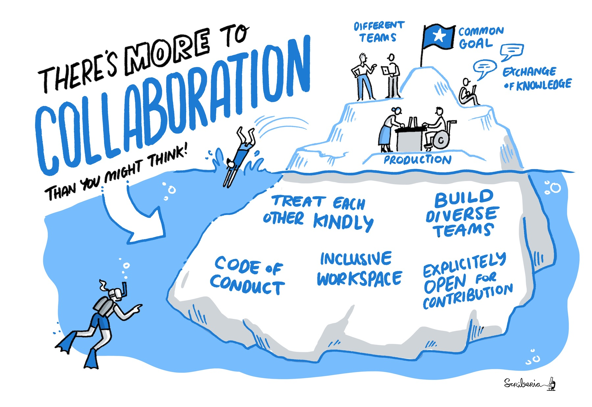

# Guide for Collaboration

***This guide covers topics related to effective and inclusive collaboration.***

| |
| ---------------|
| _The Turing Way_ project illustration by Scriberia. Zenodo. http://doi.org/10.5281/zenodo.3695300 |

Data science is defined by its interdisciplinarity.
Our work can only reach its greatest potential if there are diverse teams of people involved in designing and delivering the research or product.

There are many different skills required to work well in groups with a range of expertise.
In this guide, we welcome contributions for developing guidance on following (but not limited to) topics:

* Designing a project that welcomes contributions
* Distributed collaboration on GitHub
* Reviewing team member's contributions
* Remote working
* Running an inclusive event
* Chairing a meeting
* Defining explicit expectations
* Participatory co-creation
