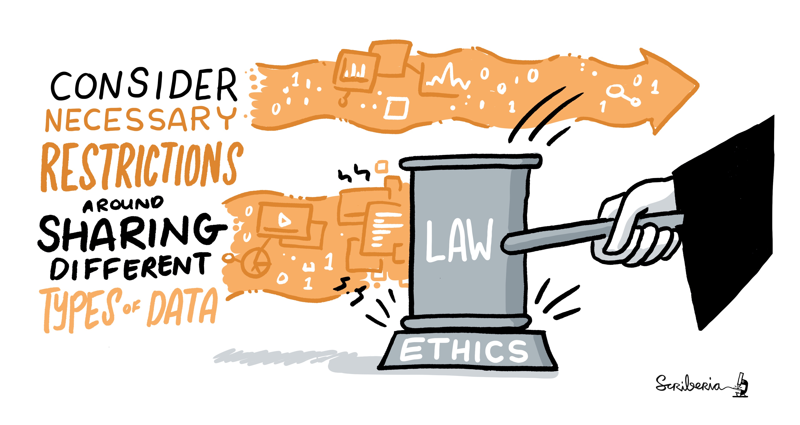

# Guide for Ethical Research

***This guide covers topics related to the role of ethics within data science.***

Data science brings together computational, algorithmic and statistical techniques to conduct research on large volumes of data. The scale and scope of data science mean it can make enormous impact on health, security, public policy and society at large. Given this, researchers and the many stakeholders of data science projects have an obligation to consider the ethical implications of their work {cite}`Loyola2020Ethics`.

In this guide, we invite discussions and guidance on ethical considerations that a data scientist should keep in mind to ensure not only that their work maintains a high level of moral integrity, but also that their work is carried out at the highest scientific standards.

|  |
| ---------------|
| _The Turing Way_ project illustration by Scriberia. Zenodo. http://doi.org/10.5281/zenodo.3695300 |
