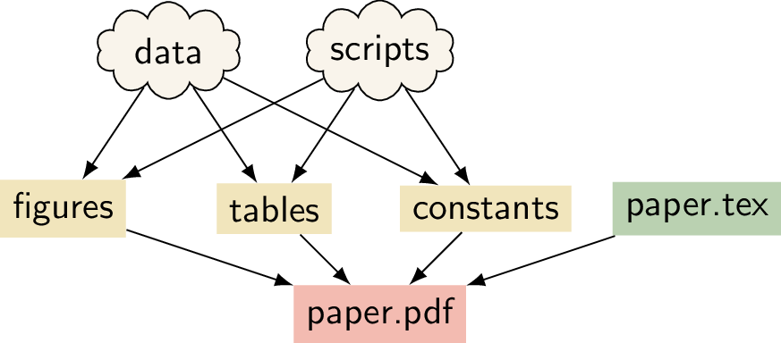

# Reproducibility with Make

## Prerequisites

| Prerequisite | Importance | Notes |
| ------------ | ---------- | ----- |
| [Experience with the command line](https://programminghistorian.org/en/lessons/intro-to-bash) | Necessary | |
| [Version control](./version-control) | Helpful | Experience using git is useful to follow along with examples |

Recommended skill level: intermediate

(rr-make-summary)=
## Summary

A data science or research project can be seen as a tree of dependencies: the
report depends on the figures and tables, and these in turn depend on the data
and the analysis scripts used to process this data (illustrated in the figure
below).  Make is a tool for creating output files from their dependencies
through pre-specified rules.  It is possible to combine these two ideas to
create a reproducible project with Make.  In this chapter we give an
introduction to Make and provide a tutorial on how Make can be used for a data
analysis pipeline.  We also describe a real-world reproducible research
project that uses Make to go from the raw input data to the experiments all
the way to the pdf file of the paper!

<small style="margin: 5pt auto; text-align: center; display: block;">A
schematic for a research project that uses LaTeX.</small>

## Why This is Useful

### What is Make

Make is a build automation tool. It uses a configuration file called a
Makefile that contains the *rules* for what to build. Make builds *targets*
using *recipes*.  Targets can optionally have *prerequisites*.  Prerequisites
can be files on your computer or other targets. Make determines what to build
based on the dependency tree of the targets and prerequisites (technically,
this is a {ref}`rr-make-resources-dag`). It uses the *modification time* of 
prerequisites to update targets only when needed.

### Why use Make for Reproducibility?

There are several reasons why Make is a good tool to use for reproducibility:

1. Make is easy to learn
1. Make is available on many platforms
1. Make is flexible
1. Many people are already familiar with Make
1. Makefiles reduce cognitive load because as long as the common Make targets
   ``all`` and ``clean`` are present (explained below), you can be up and
   running without having to read lengthy instructions. This is especially
   useful when you work on someone else's project or on one that you haven't
   used in a long time.
1. Makefiles are human-readable and machine-readable text files. So instead of
   writing instructions to a human for how to build a report or output, you
   can provide a Makefile with instructions that can be read by a human *and*
   executed by a computer.
1. Because Makefiles are text files they are easy to share and keep in version
   control.
1. Using Make doesn't exclude using other tools such as Travis and Docker.

With a clever Makefile, you can share a complete analysis (code, data, and
computational workflows) and let collaborators or the readers of your paper
recompute your results.
By using tools such as LaTeX, you can even generate a complete manuscript that
includes freshly computed figures and results!
This can increase the trust in the research output that you generate, it can
make your research more accessible, and it can make collaborating easier.
This chapter can show you how to get started.
