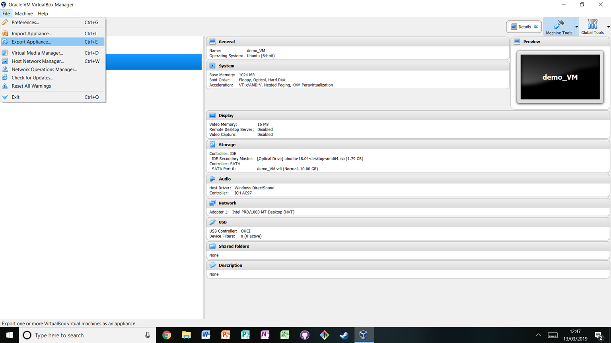

# Virtual machines

## Table of contents

- [What are virtual machines?](#What_are_virtual_machines)
- [Using virtual machines for reproducible research](#Using_virtual_machines_for_reproducible_research)
 - [Setting up a virtual machine](#Setting_up_a_virtual_machine)
 - [Starting a virtual machine](#Starting_a_virtual_machine)
 - [Sharing virtual virtual machines](#Sharing_virtual_virtual_machines)

## What are virtual machines?

Virtual machines (VMs) essentially package a whole computer as an app that can be run. As an example see the figure below which shows a windows laptop (note the windows search button in the lower left corner) running a virtual Ubuntu machine (note the terminal outputting the operating system).
The machine running the VM is called the "host machine".
Using software like [VirtualBox](https://www.virtualbox.org/) or [Vagrant](https://www.vagrantup.com/), a user can create and run any number of VMs.
As you could probably guess, having several VMs running at once can be a drain on memory, so just because you can run several at once doesn’t mean you should.

Users can download, install, backup and destroy VMs at will, which is part of what makes them an attractive tool for sharing reproducible research.
Research often requires specific pieces of software or system settings.
If a researcher wishes to reproduce another's work on their own computer making the necessary changes to their environment to run the project may impact their own work.
For example near the very start of this chapter it was [described](#How_this_will_help_you_why_this_is_useful) how using a different version of Python can lead to unexpected changes in the results of an analysis.
Say a researcher installs an updated version of Python to replicate an analysis because the analysis requires features only present in the updated version.
By doing so they put their own work at risk. VMs remove that risk; any tools downloaded or settings changed will only impact the VM, keeping the reproducer's research safe.
If they do inadvertently break something in the VM, they can just delete it and make another one.
They are effectively a quarantined area.

## Using virtual machines for reproducible research

Virtual machines can be shared by exporting them as single files.
Another researcher can then import that file using their own virtualisation software like [VirtualBox](https://www.virtualbox.org/) and open up a copy of the VM which will contain all the software files and settings put in place by the person that made the VM.
Therefore in practice they will have a working version of the project without the pain of setting it up themselves.

### Setting up a virtual machine

First choose a tool for generating VMs.
Here the widely-used [VirtualBox](https://www.virtualbox.org/) is chosen. Download and install it on your system.
To create a new machine click "New" in the top left.
A window will pop up where you can enter a name for the machine and select what operating system and version of the operating system to use.
In the figure below a machine called demo_VM running Ubuntu is being created:

As you click through you can adjust other features of the machine to be created such as how much memory it should have access to.
The default options are suitable for most purposes, but this process permits customisation.

### Starting a virtual machine

To start a virtual machine simply select the machine from the list of VMs on the left, and click the green "start" arrow at the top:

### Sharing virtual virtual machines

A researcher can do work on their VM, and then export the whole thing.
To export a virtual machine click "File" in the top left and then "Export".
This will export the VM as a single file which can be shared like any other.

Someone that has access to this file and VirtualBox installed just needs to click "File" in the top left and then "Import" and select that file.
Once it is imported they can start the VM as described before by selecting it from the menu clicking the green start arrow at the top.
