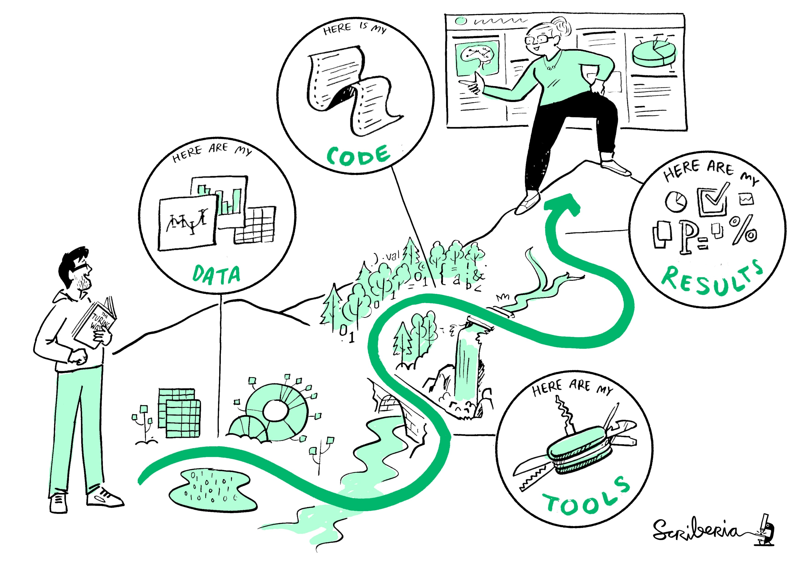

# Guide to Reproducible Research

***This guide covers topics related to skills, tools and best practices for research reproducibility.***

_The Turing Way_ defines reproducibility in data research as data and code being available to fully rerun the analysis.

There are several definitions of reproducibility in use, and we discuss these in more detail in the {ref}`rr-overview-definitions` section of this chapter.
However, _The Turing Way_'s definition used by _The Turing Way_ Team at the time of writing, will be useful to avoid misunderstandings when reading the rest of the handbook.

In this guide, we start with defining reproducibility in the context of this handbook, lay out its importance for science and scientists, and provide an overview of the common concepts, tools and resources.

|  |
| ---------------|
| _The Turing Way_ project illustration by Scriberia. Zenodo. http://doi.org/10.5281/zenodo.3695300 |

Since the start of this project in 2019, several crucial chapters have been written, edited, reviewed, read and promoted by over 100 contributors.
We welcome you contributions on topics covering important concepts in reproducibility and how to ensure them in our research.
