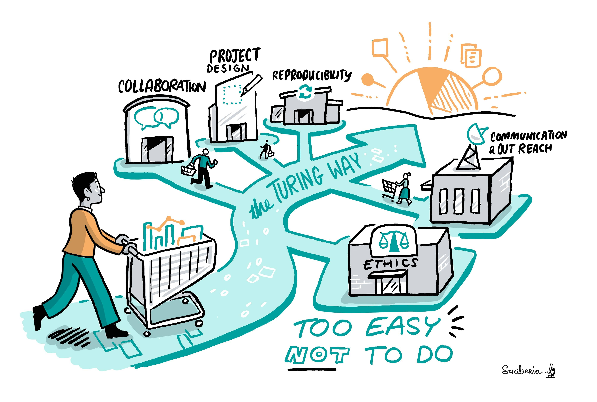
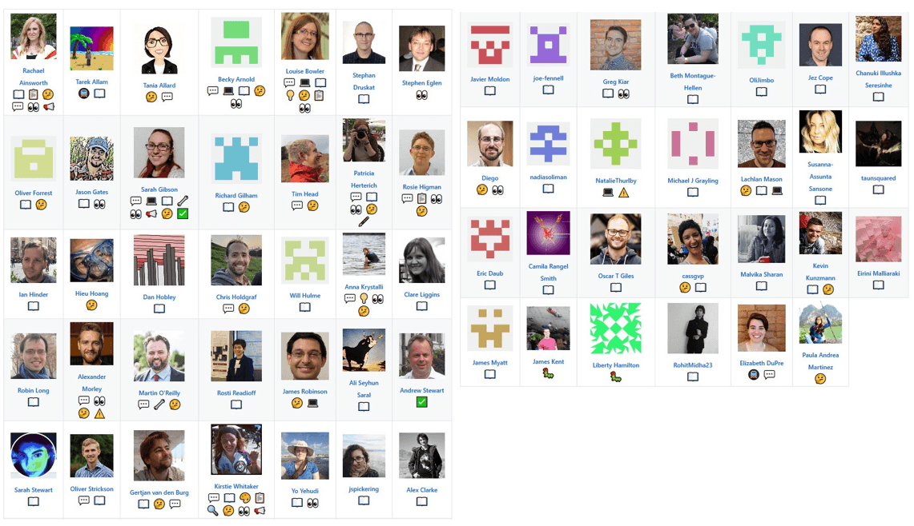

# Welcome

_The Turing Way_ is an open source community-driven guide to reproducible, ethical, inclusive and collaborative data science.

Our goal is to provide all the information that data scientists in academia, industry, government and in the third sector need at the start of their projects to ensure that they are easy to reproduce and reuse at the end.

The book started as a guide for reproducibility, covering version control, testing, and continuous integration.
But technical skills are just one aspect of making data science research "open for all".

In February 2020, _The Turing Way_ expanded to a series of books covering reproducible research, project design, communication, collaboration, and ethical research.

## Our community

_The Turing Way_ community is dedicated to making collaborative, reusable and transparent research "too easy not to do".
That means investing in the socio-technical skills required to work in a team, to build something greater than the any individual person could deliver alone.

_The Turing Way_ is:

* a book
* a community
* a global collaboration
* a whole tonne of work

We hope you find the content in the book helpful.
Everything here is available for free under a [CC-BY licence](https://github.com/alan-turing-institute/the-turing-way/blob/master/LICENSE.md).
Please use and re-use whatever you need for any purpose.

The book is collaboratively written and open from the start.
We invite you to join our community.
To make this project truly accessible and useful for everyone, we invite you to contribute your skills and bring your perspectives into this project.
[Community Handbook](./community-handbook/community-handbook), including how to [get in touch](https://github.com/alan-turing-institute/the-turing-way#get-in-touch) and how to [start contributing](https://github.com/alan-turing-institute/the-turing-way/blob/master/CONTRIBUTING.md).
We look forward to expanding and building _The Turing Way_ together.

Although _The Turing Way_ receives support and funding from [The Alan Turing Institute](https://www.turing.ac.uk/), the project is designed to be a global collaboration.
We have contributions from across the UK, and from India, Mexico, Australia, USA, and many European countries.
Chapters have been written, reviewed and curated by members of research institutes and universities, government departments, and 

We value the participation of every member of our community and want to ensure that every contributor has an enjoyable and fulfilling experience.
Accordingly, everyone who participates in the _Turing Way_ project is expected to show respect and courtesy to other community members at all times.
All contributions must abide by our [code of conduct](https://github.com/alan-turing-institute/the-turing-way/blob/master/CODE_OF_CONDUCT.md).

## A little more background

Reproducible research is necessary to ensure that scientific work can be trusted.
Funders and publishers are beginning to require that publications include access to the underlying data and the analysis code.
The goal is to ensure that all results can be independently verified and built upon in future work.
This is sometimes easier said than done.
Sharing these research outputs means understanding data management, library sciences, software development, and continuous integration techniques: skills that are not widely taught or expected of academic researchers and data scientists.

The Turing Way is a handbook to support students, their supervisors, funders, and journal editors in ensuring that reproducible data science is "too easy not to do".
It will include training material on version control, analysis testing, open and transparent communication with future users, and build on Turing Institute case studies and workshops.
This project is openly developed and any and all questions, comments and recommendations are welcome at our GitHub repository: [https://github.com/alan-turing-institute/the-turing-way](https://github.com/alan-turing-institute/the-turing-way).

You can see all of our incredible contributors in our [README](https://github.com/alan-turing-institute/the-turing-way#contributors) file, and screengrabbed below.

## Citing _The Turing Way_

You can reference _The Turing Way_ through the project's Zenodo archive using doi: [10.5281/zenodo.3233853](https://doi.org/10.5281/zenodo.3233853).

The citation will look something like:

> The Turing Way Community, Becky Arnold, Louise Bowler, Sarah Gibson, Patricia Herterich, Rosie Higman, … Kirstie Whitaker. (2019, March 25). The Turing Way: A Handbook for Reproducible Data Science (Version v0.0.4). Zenodo. http://doi.org/10.5281/zenodo.3233986

Please visit the [DOI link](https://doi.org/10.5281/zenodo.3233853) though to get the most recent version - the one above is not automatically generated and therefore may be out of date.
DOIs allow us to archive the repository and they are really valuable to ensure that the work is tracked in academic publications.

You can also share the human-readable URL to a page in the book, for example: [https://the-turing-way.netlify.com/reproducibility/03/definitions.html](https://the-turing-way.netlify.com/reproducibility/03/definitions.html), but be aware that the project is under development and therefore these links may change over time.
You might want to include a [web archive link](http://web.archive.org) such as: [https://web.archive.org/web/20191030093753/https://the-turing-way.netlify.com/reproducibility/03/definitions.html](https://web.archive.org/web/20191030093753/https://the-turing-way.netlify.com/reproducibility/03/definitions.html) to make sure that you don't end up with broken links everywhere!

We really appreciate any references that you make to _The Turing Way_ project in your work and we hope it is useful.
If you have any questions please [get in touch](https://github.com/alan-turing-institute/the-turing-way#get-in-touch).
